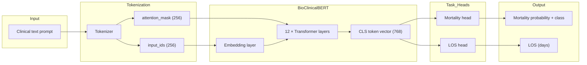
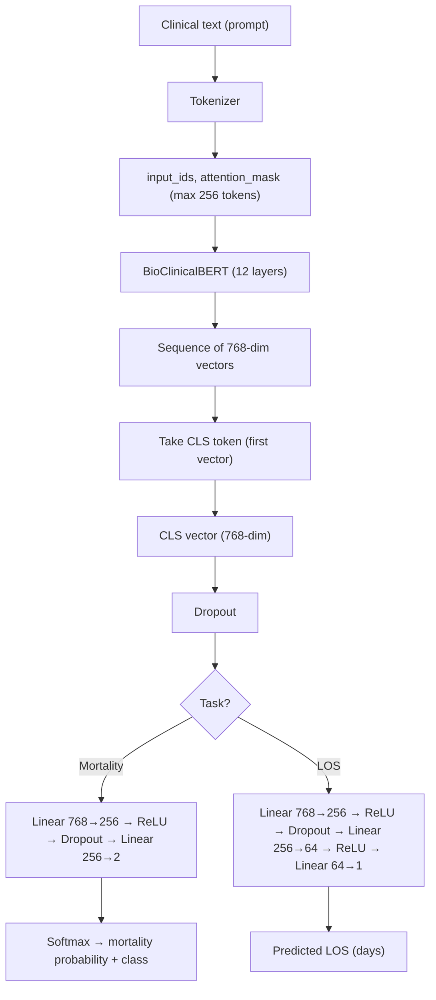

# How the Fine-Tuned LLM Works: BioClinicalBERT

This document explains how the **fine-tuned BioClinicalBERT** pipeline works: from clinical text (prompt) to mortality risk and length-of-stay predictions. The implementation is in `mortality_llm_finetuning.py` and requires PyTorch and the Hugging Face Transformers library.

---

## 1. What Is BioClinicalBERT?

- **Model:** `emilyalsentzer/Bio_ClinicalBERT` (Hugging Face).
- **Architecture:** BERT-base — 12 transformer layers, hidden size 768, ~110 million parameters.
- **Pre-training:** Trained on **clinical notes from MIMIC-III** (discharge summaries, progress notes). It already understands medical terms and context.
- **Role here:** We use it as a **feature extractor** for our clinical prompts, then add small **task heads** and **fine-tune** the whole model (BERT + heads) on our mortality and LOS labels.

So: BioClinicalBERT is a **clinical language model** that turns text into a single 768-dimensional vector (the CLS embedding); we train extra layers on top of that vector to predict mortality and LOS.

---

## 2. End-to-End Flow (Conceptual)

1. **Input:** One clinical “prompt” per admission (same paragraph format as in the TF-IDF pipeline: demographics, admission type, diagnoses, etc.).
2. **Tokenization:** The prompt is split into **subword tokens** (WordPiece), padded/truncated to 256 tokens, and converted to numeric IDs and an attention mask.
3. **BERT:** Token IDs and attention mask go through BioClinicalBERT. The model outputs a vector for each token; we take only the **first token’s vector (CLS)** as a summary of the whole text (768 dimensions).
4. **Task heads:** The CLS vector is passed through a small neural network:
   - **Mortality:** Linear layers → 2 logits → softmax → probability of “Expired.”
   - **LOS:** Linear layers → 1 number → predicted length of stay in days.
5. **Training:** We minimize cross-entropy (mortality) and MSE (LOS) with AdamW and a learning-rate schedule, updating **both** BERT and the task heads (full fine-tuning).

---

## 3. Flowchart

### 3.1 Mermaid (for GitHub / supported viewers)



### 3.2 Vertical flowchart (Mermaid)



### 3.3 ASCII flowchart (plain text)

```
┌─────────────────────────────────────────────────────────────────────────────┐
│                         FINE-TUNED LLM: BioClinicalBERT                      │
└─────────────────────────────────────────────────────────────────────────────┘

  ┌──────────────────────┐
  │ Clinical text prompt │  "Patient is a 65 year old male..."
  └──────────┬───────────┘
             │
             ▼
  ┌──────────────────────┐
  │ Tokenizer (WordPiece) │  max_length=256, padding, truncation
  └──────────┬───────────┘
             │
             ▼
  ┌──────────────────────┐
  │ input_ids (256)       │  Token IDs
  │ attention_mask (256) │  Which positions are real vs padding
  └──────────┬───────────┘
             │
             ▼
  ┌──────────────────────────────────────────────────────────────────────────┐
  │                     BioClinicalBERT (12 transformer layers)               │
  │  • Embedding layer                                                        │
  │  • 12 × (self-attention + feed-forward), hidden_size=768                  │
  │  • Output: one 768-dim vector per token (256 × 768)                       │
  └──────────┬───────────────────────────────────────────────────────────────┘
             │
             ▼
  ┌──────────────────────┐
  │ CLS token (position 0)│  Single 768-dim vector = “summary” of whole text
  └──────────┬───────────┘
             │
             ▼
  ┌──────────────────────┐
  │ Dropout(0.3)         │
  └──────────┬───────────┘
             │
       ┌─────┴─────┐
       ▼           ▼
  ┌─────────┐  ┌─────────┐
  │ Mortality│  │   LOS   │
  │   head   │  │  head   │
  │ 768→256  │  │ 768→256 │
  │ →256→2   │  │ →64→1   │
  └────┬────┘  └────┬────┘
       │            │
       ▼            ▼
  ┌─────────┐  ┌─────────┐
  │ Softmax │  │ 1 value │
  │ P(Expired)│  │ LOS days│
  └─────────┘  └─────────┘
```

---

## 4. Main Components in More Detail

### 4.1 Tokenization

- The **same** clinical prompt string used in the TF-IDF pipeline is fed to the BERT tokenizer.
- The tokenizer splits text into **subword tokens** (e.g. "patient" → one token, "hypertension" → possibly "hyper", "##tension").
- Outputs:
  - **input_ids:** Integer IDs for each token (length ≤ 256).
  - **attention_mask:** 1 for real tokens, 0 for padding. BERT uses this so padding is ignored.
- Prompts longer than 256 tokens are **truncated**; shorter ones are **padded** to 256.

### 4.2 BioClinicalBERT Encoder

- **Input:** `input_ids` and `attention_mask` (batch × 256).
- **Inside:** Embedding layer turns IDs into vectors, then 12 transformer blocks (self-attention + feed-forward, layer norm, residual connections). Each token gets a 768-dim representation that depends on the full sequence.
- **Output:** A tensor of shape (batch × 256 × 768). We take **only the first token** (the [CLS] token): shape (batch × 768). This CLS vector is the standard BERT “sentence/document” embedding used for classification or regression.

### 4.3 Task Heads (What We Train)

- **Mortality head:**  
  `CLS (768) → Linear(768→256) → ReLU → Dropout(0.3) → Linear(256→2) → logits`  
  Softmax on the 2 logits gives P(Survived) and P(Expired). Loss = cross-entropy with true `hospital_expire_flag`.

- **LOS head:**  
  `CLS (768) → Linear(768→256) → ReLU → Dropout → Linear(256→64) → ReLU → Linear(64→1) → scalar`  
  Loss = MSE between predicted and actual LOS in days.

- **Fine-tuning:** All parameters (BERT + both heads) are updated via backpropagation. We do **not** freeze BERT.

### 4.4 Training Setup

- **Optimizer:** AdamW (e.g. lr=2e-5, weight decay=0.01).
- **Schedule:** Linear warmup (e.g. 10% of steps), then linear decay.
- **Epochs:** e.g. 5.
- **Batch size:** e.g. 16.
- **Gradient clipping:** Max norm 1.0.
- **Validation:** After each epoch we compute validation loss and (for mortality) AUC; the **best** model by validation metric is kept.

---

## 5. Summary Table

| Stage            | Input                    | Output                          |
|------------------|--------------------------|---------------------------------|
| Prompt           | Admission data           | Clinical text (one paragraph)   |
| Tokenizer        | Clinical text             | input_ids, attention_mask (256) |
| BioClinicalBERT  | input_ids, attention_mask | CLS vector (768)                |
| Mortality head   | CLS (768)                 | Mortality probability + class   |
| LOS head         | CLS (768)                 | Predicted LOS (days)            |

---

## 6. Difference From the TF-IDF + Gradient Boosting Pipeline

| Aspect        | TF-IDF + Gradient Boosting   | Fine-tuned BioClinicalBERT        |
|---------------|------------------------------|-----------------------------------|
| Text → numbers| TF-IDF (bag of words, 5k dim)| Tokenizer + BERT (sequence, 768)  |
| Model         | Tree ensemble                | Transformer + small neural heads |
| Training      | No backprop                  | Backprop, AdamW, fine-tune BERT  |
| Context       | No word order / context      | Full sequence context (attention)|

The **fine-tuned LLM** uses the **same** clinical prompt as input but processes it with a **transformer** (BioClinicalBERT) and **neural task heads**, trained with backpropagation to predict mortality and LOS.
